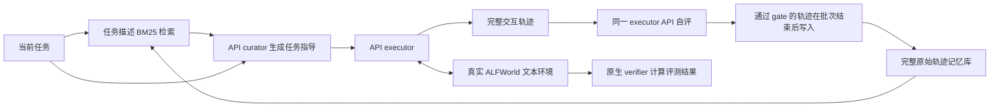

# JITMEM：通过模型 API 复现 ALFWorld pipeline

这个项目实现 [Just-in-Time Memory](https://arxiv.org/pdf/2609.27334) 的推理与 streaming 评估流程，使用可配置的模型 API，无本地模型训练。当前对应 prompted / untrained curator 变体；普通模型 API 的结果不能当作论文 RL-trained JITMEM 的结果。

ALFWorld 文本交互环境已在项目 `.venv` 中安装并验证。数据直接读取本机配置的 `data_root`，不复制进仓库。原始数据是游戏资源，并非已完成的 LLM 轨迹；默认记忆库在每个 run 开始时为空，由模型执行任务后逐批积累。

2026-10-08 已完成用户 API 的 no-memory / prompted JITMEM 成对评测：`valid_seen` 全部 140 个任务，seeds 0、1、2，每组 420 次、共 840 次真实交互。curator/executor 配置模型名均为 `gpt-5.5`；无 warm start，batch10、workers10、history3、最多30次决策。成功率由原生环境判定，均值与样本标准差按三轮计算。

| 方法 | 成功率 mean ± std | 平均决策次数 | 全角色 input + output tokens |
| --- | ---: | ---: | ---: |
| no-memory | 77.86 ± 1.43% | 14.85 | 3,021,642 |
| prompted JITMEM | 86.67 ± 0.41% | 11.23 | 4,623,861 |

成功率提升 8.81 个百分点，决策次数减少 24.35%，总 token 用量增加 53.02%。模型名来自 API 配置，不能据此验证服务端模型权重；本次结果属于当前 prompted 实现。仓库保存 [评测结果报告](docs/results/alfworld_valid_seen_2026-10-08.md) 与 [结构化结果](docs/results/alfworld_valid_seen_2026-10-08.json)。完整逐任务证据和原始请求日志保存在本地 `outputs/`，执行分析命令可生成 `outputs/comparison/comparison.md`。外部数据 18,416 个文件的内容、大小和修改时间在评测前后均未改变。

2026-10-09 已另行完成论文 Table 9 的存储消融，两组使用安全加固后相同实现，重新进行 140任务×3轮×2组，共840次真实交互：

| 存储策略 | 成功率 mean ± sample std | 成功 / 420 | 平均决策次数 |
| --- | ---: | ---: | ---: |
| 质量过滤：仅保留 judge 成功轨迹 | 85.71 ± 2.14% | 360 / 420 | 11.33 |
| 全量存储：向 curator 展示 judge 标签 | 88.57 ± 1.24% | 372 / 420 | 11.12 |

过滤减全量为 **−2.86 ± 2.47 个百分点**，本次 API 配置未复现论文“过滤更优”的方向。论文使用未训练的 Qwen3-8B curator，本次 curator/executor 均为配置的 `gpt-5.5`，提示词也有改写；三轮差异为描述性结果，不宣称统计显著或外推到原模型。独立审计已核对全部840条记录、prompt、BM25排序与指标；另有40条原生轨迹重放。详细数字见[存储消融结果](docs/results/alfworld_storage_ablation_2026-10-09.md)与[结构化结果](docs/results/alfworld_storage_ablation_2026-10-09.json)。

## 仓库结构

| 路径 | 内容 |
| --- | --- |
| `src/jitmem/` | API、记忆检索、curator/executor pipeline、环境与评估器 |
| `tests/` | 不依赖外部模型或真实数据集的软件测试 |
| `configs/` | 实验配置模板；本机 `*.local.toml` 不提交 |
| `scripts/` | 环境安装、原生环境验证、结果分析 |
| `docs/` | 论文分析、复现规格、验证记录与评测结果 |
| `outputs/` | 本地生成的完整轨迹、请求日志、checkpoint；不提交 |

`.venv/`、`.python/`、缓存和密钥文件均由 `.gitignore` 排除。ALFWorld 数据集位于项目外，不纳入 Git。仓库结果报告不包含 API endpoint、密钥或原始模型请求。

新克隆的项目可先验证软件，无需 ALFWorld 数据或 API key（需要 Python 3.11 或更高版本）：

```bash
python3.11 -m venv .venv
.venv/bin/python -m pip install -e '.[dev]'
.venv/bin/python -m pytest -q
.venv/bin/python -m jitmem smoke
```

运行真实环境时，将 `configs/alfworld.example.toml` 复制为 `configs/alfworld.local.toml`，设置 `[environment] data_root` 为实际路径，并运行 `bash scripts/setup_alfworld.sh /path/to/alfworld`。后续环境和评测命令追加 `--config configs/alfworld.local.toml`。

## 流程与实现



检索仅索引任务描述，默认 top-3。curator 每个任务调用一次，其临时 payload 在整个 episode 内复用。executor 每步读取当前 observation、admissible actions 和最近 3 步历史，最多 30 次决策。judge 读取完整轨迹，不读取 native `success` / `reward` 标量。每 10 个任务共享固定的 memory snapshot，完成这一批后统一写入；运行默认 seed 0、1、2，分别从空库开始。默认串行执行；`--workers 10` 使用 spawn 独立进程并行执行同一批任务，仍共享该批开始时的固定记忆快照，并按任务顺序在批次结束后写入。TextWorld 的规划器使用进程全局状态，因此环境采用进程隔离。

全文中文分析见 [docs/paper_analysis_zh.md](docs/paper_analysis_zh.md)，来源、prompt 改写、原文设置与工程选择的区分见 [docs/reproduction_spec.md](docs/reproduction_spec.md)。论文未披露的配置包括 exact seeds、BM25 tokenizer、空库行为和 curator inference token limit，本项目将其明确记录。Qwen thinking 设置需要服务端支持，模型名本身不能保证该模式。

## 环境与数据

| Split | 官方筛选后的文本任务数 | 用途 |
| --- | ---: | --- |
| train | 3553 | 训练数据 / 可选训练经验收集 |
| valid_train | 200 | 额外验证 |
| valid_seen | 140 | 默认对照评测 |
| valid_unseen | 134 | 泛化评测，单独报告 |

`valid_seen` 的六类数量为 Pick 35、Look 13、Clean 27、Heat 16、Cool 25、Pick2 24，与 SkillOS 的 140-task 设置相符。JITMEM 没有直接命名 split；采用 `valid_seen` 属于来源支持的推断。

当前已验证 Python 3.11.16、ALFWorld 0.4.2、TextWorld 1.6.2、fast-downward-textworld 20.6.4，在 macOS Apple Silicon 使用原生 wheel。只安装 text mode，不下载模型权重、THOR 视觉环境或数据。完整已验证依赖版本保存在 `requirements-lock.txt`。重新安装时执行：

```bash
cd /Users/linbei/workspace/Reproduction/JitMem
bash scripts/setup_alfworld.sh
.venv/bin/python -m jitmem doctor
.venv/bin/python -m jitmem env-smoke
```

`doctor` 检查数据和依赖；`env-smoke` 执行真实游戏的 reset 和 look。验证六类任务的完整 native success，可运行：

```bash
.venv/bin/python scripts/verify_native_environment.py
```

默认检查 seen/unseen 各六类任务；完整 140 个默认评测游戏的环境预检：

```bash
.venv/bin/python scripts/verify_native_environment.py --all --splits valid_seen \
  --output outputs/native_valid_seen_full.json
```

这个命令只用游戏自带 walkthrough 验证模拟器，报告明确标注 `expert_only=true`、`is_model_benchmark=false`。walkthrough 不进入模型 agent、评估 memory 或默认 pipeline。

## 接入模型 API

当前 API adapter 支持 OpenAI-compatible `POST /chat/completions`。原生 Gemini / Anthropic 等其他格式需要兼容 gateway 或新增 adapter。curator 和 executor 可以指定不同模型、endpoint 和密钥环境变量；judge 固定复用 executor client。endpoint 可以是 base URL 或完整的 `/chat/completions` URL。

base URL、模型名和 key 通过环境变量指定；无需编辑配置文件中的模型值：

```bash
export OPENAI_MODEL="your-model-name"
export OPENAI_API_KEY="your-api-key"
# 可选：省略时使用 https://api.openai.com/v1
export OPENAI_BASE_URL="https://api.openai.com/v1"
```

默认 curator、executor 和 judge 使用相同的模型 API。需要不同 curator 时可单独设置 `JITMEM_CURATOR_MODEL`、`JITMEM_CURATOR_BASE_URL`、`JITMEM_CURATOR_API_KEY`；executor 对应 `JITMEM_EXECUTOR_MODEL`、`JITMEM_EXECUTOR_BASE_URL`、`JITMEM_EXECUTOR_API_KEY`。role 环境变量优先于共同 `OPENAI_*` 变量，环境变量优先于可选的 TOML 配置。密钥值不进入 TOML、manifest 或日志。judge 始终复用 executor。

也可以复制 `.env.example` 为 `.env`，填入参数后执行 `source .env`；程序不自动读取 `.env`。该文件不会提交到 Git。

## 密钥保护与扫描

认证凭证只通过 API key 环境变量提供。`extra_body` 禁止嵌套凭证字段，防止其被写入实验 manifest；客户端拒绝 HTTP 重定向和含空白、控制字符或非 ASCII 字符的 key，错误信息不回显密钥。endpoint 不允许用户名、密码、查询参数或 fragment。不要把密钥放入任务描述、提示词、文档或模型参数。

本机已启用 `.githooks/pre-commit`扫描暂存区、`.githooks/pre-push`扫描完整历史；GitHub 原生密钥扫描和推送保护已启用。新克隆需要安装 [Gitleaks](https://github.com/gitleaks/gitleaks)（验证版本 8.30.1），然后启用钩子：

```bash
brew install gitleaks
git config core.hooksPath .githooks
bash scripts/check_secrets.sh history
```

也支持将官方二进制置于被忽略的 `.tools/gitleaks`。扫描器缺失或扫描发现问题时，提交钩子会失败。当前 GitHub 登录令牌不含 `workflow` 权限，Gitleaks CI 配置保留在 `configs/secret-scan.workflow.example.yml`；授权更新 workflow 后可复制到 `.github/workflows/secret-scan.yml` 启用。唯一扫描例外是经过验证的原实验 `api.py` 固定 SHA256 值，不排除整个文件、目录或提交。检查范围与结果见 [密钥安全审计](docs/security_audit.md)。

修改采样、模型特有参数或实验设置时，可复制 `configs/alfworld.example.toml` 到 `configs/alfworld.local.toml`。模型要求 `max_completion_tokens` 时修改 `token_limit_parameter`；模型不接受 temperature 时设置 `omit_temperature=true`。

Qwen3 的建议参数已以注释放在样例中：executor ALFWorld thinking enabled，curator thinking disabled、temperature .6 / top-p .95 / top-k 20；GPT/Gemini curator 采用 temperature 1.0。`extra_body` 可传服务端特有参数，其支持范围需要和 API 提供方核对。curator 输出预算 8192 是工程选择，论文测试预算未披露。省略 curator 参数时会继承 executor 配置，因此使用 Qwen 时应分别显式配置 thinking。

以下命令会调用你配置的 API：

```bash
.venv/bin/python -m jitmem api-check
.venv/bin/python -m jitmem evaluate \
  --limit 5 --seeds 0 --batch-size 2 --output-dir outputs/api_pilot
```

pilot 的 batch size 2 用于在 5 个任务内检查记忆增长，与正式 batch 10 设置不同。不要将这次小样本分数与论文表格比较。

## 正式评测与对照

使用相同配置、相同完整任务集及 seeds，分别执行：

```bash
.venv/bin/python -m jitmem evaluate \
  --method no-memory --workers 10 --output-dir outputs/alfworld_no_memory
.venv/bin/python -m jitmem evaluate \
  --method jitmem --workers 10 --output-dir outputs/alfworld_jitmem
.venv/bin/python scripts/analyze_results.py \
  outputs/alfworld_no_memory outputs/alfworld_jitmem --output-dir outputs/comparison
```

使用自定义 TOML 时给上述命令追加 `--config configs/alfworld.local.toml`，确保配置没有启用 `limit`，正式 batch size 为 10。三轮评测每个方法共 420 个 episode；模型生成仍有随机性，order seeds 只控制任务顺序，不能保证 API token sampling 可复现。最多 30 次 executor 调用 / episode，JITMEM 另有 curator 和 judge 调用，详细用量分角色记录。

其他对照：`--method raw-memory` 直接注入检索轨迹；`--method write-summary` 在 write time 生成固定摘要，read time 再 curate，是简化的信息损失消融。它们不是完整 ReasoningBank、MemP 或 SkillOS 复现。配置 `[experiment] task_adaptive=false` 隐藏 curator 当前任务，`store_policy="all"` 保存所有带 judge label 的轨迹，`retrieval_k=0` 检查无检索的 curator。`--split valid_unseen` 可跑 134 个泛化任务，输出到单独目录。

论文的“Quality-filtered storage outperforms label-annotated full storage”消融使用两份配对模板：[质量过滤](configs/storage_filtered.example.toml)与[全量存储附标签](configs/storage_all.example.toml)。均为 `jitmem`、140任务×3轮、空库开始，只改变存储策略与相应标签展示。配置复制为 `*.local.toml` 后设置数据路径，分别 evaluate；完整结果用以下命令审计和比较：

```bash
.venv/bin/python -m jitmem evaluate --config configs/storage_filtered.local.toml
.venv/bin/python -m jitmem evaluate --config configs/storage_all.local.toml
.venv/bin/python scripts/analyze_storage_ablation.py \
  outputs/storage_filtered outputs/storage_all --output-dir outputs/storage_ablation_comparison
```

原文Table9、实验设置和解释边界见[存储消融协议](docs/storage_ablation.md)。标签来自executor judge，原生成功仅用于评分；比较差值定义为过滤减全量，结果不预设方向。

默认不 warm start；可在配置设置 `warm_start` 为训练轨迹 `memory.jsonl`，校验只含 `train`、不与 evaluation task IDs 重合，默认 gate 下要求正的 executor judge 标签。若要收集 API 训练经验，可对 train split 执行 `jitmem` 或 `raw-memory`；这只是轨迹收集，不是 GRPO 或本文训练复现。

## 输出与续跑

每次评测输出 `manifest.json`，包含模型设置、任务 manifest、game/source SHA256、环境版本和未披露设置的具体取值。每个 seed 单独保存 `task_order.json`、逐 episode 轨迹与请求日志、`memory.jsonl`、`results.jsonl`、`checkpoint.json` 和 `summary.json`。顶层 `summary.json` 汇总各轮 SR 均值和 sample standard deviation（ddof=1）。

指标还包括分任务类/批次 SR、决策与实际环境步数、非法输出、budget truncation、memory size、judge/native confusion、judge parse errors，以及 executor、curator、judge、distiller 分角色用量。所有任务参与分母；API/环境故障显式报错并暂停本次运行，不当作任务失败混入 SR。

模型生成达到 token 上限或被过滤时保留 `finish_reason` 和 `generation_failures`，继续评测：executor 不执行部分输出并消耗一次决策，curator 省略失败的 briefing，judge 拒绝该结果，distiller 不保存失败的摘要。不会通过反复续跑选择完整输出。API 不返回 usage 时，受影响的 token 总数及均值为 `null`，并标记 `usage_complete=false`，不能当作零用量或用于 token 节省比较。

checkpoint 只在完整 batch 后提交。发生故障后用相同命令追加 `--resume`，从最后提交的 batch 继续；未提交批次可能重跑并再次消耗 API 用量。配置、任务文件或实现 hash 改变时拒绝续跑，防止混合实验协议。已有输出目录默认拒绝覆盖。运行审计日志保存 payload 便于检查，持久 memory bank 不保存 payload。

## 软件验证

```bash
.venv/bin/python -m pytest -q
.venv/bin/ruff check src tests scripts
.venv/bin/python -m jitmem smoke --resume
```

`smoke` 使用独立的假环境和确定性 client，检查 cold start、批次写入和下一批检索，明确标注为 offline fixture。其成功率是软件测试结果。HTTP 集成测试启动本机回环 server，验证真实请求序列，不访问外部模型 API；受限制的执行沙箱可能需要允许本机端口监听。验证记录见 [docs/validation.md](docs/validation.md)。真实模型结果与软件验证分别记录在验证文档中。
